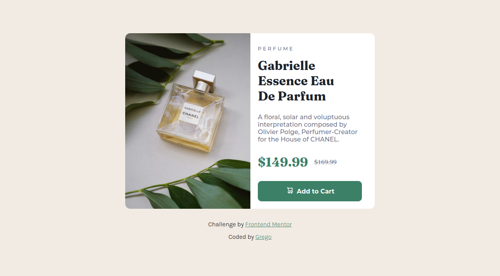

# Frontend Mentor - Product preview card component solution

This is a solution to the [Product preview card component challenge on Frontend Mentor](https://www.frontendmentor.io/challenges/product-preview-card-component-GO7UmttRfa). Frontend Mentor challenges help you improve your coding skills by building realistic projects.

## Table of contents

- [Overview](#overview)
  - [Screenshot](#screenshot)
  - [Links](#links)
- [My process](#my-process)
  - [Built with](#built-with)
- [Author](#author)

## Overview

### Screenshot

### Links

[Solution](https://github.com/Grego14/product-preview-card-component) | [Live Site URL](https://grego14.github.io/product-preview-card-component/)

## My process

### Built with

- Semantic HTML5 markup
- CSS3 custom properties
- Flexbox
- Media Query

## Author

- Github Profile - [@Grego14](https://github.com/Grego14)
- Frontend Mentor - [@Grego14](https://www.frontendmentor.io/profile/Grego14)
